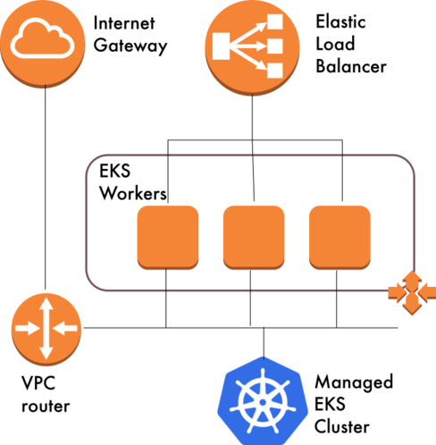

% Making Kubernetes Easy With Ansible
% Will Thames, Skedulo
% October 2018

---

<div class="intro">
<h3>How did you get started with Ansible?</h3>

I saw a post by Michael Dehaan about a new configuration management system
and thought "here we go, just what the world needs, yet another CM"

I was working at a banking/insurance company with locked down application
servers with no root access or agents allowed. I had ssh and python though...

<h3>How long have you been using it?</h3>

My first commit was July 2012&mdash;so some time around then

<h3>What's your favourite thing to do when you Ansible?</h3>

Mostly Kubernetes these days! But AWS works pretty well too
</div>

---

# Making Kubernetes Easy With Ansible
## Will Thames, Skedulo
### October 2018

<div class="image-left"></div>
<div class="image-right"></div>

---

# About Skedulo

- Skedulo is the platform for intelligent mobile workforce management
- Helps enterprises intelligently manage, schedule, dispatch, and track
  workers in the field
- Typical use-cases include healthcare, property management, home
  improvement services

<div class="image-right"></div>

---

# Skedulo Platform

- AWS underlying infrastructure built using terraform
- Kubernetes 1.9 built using kops
- Ansible for everything on top
- AWX for deployments
- 10s of applications

<aside class="notes">
We're lucky to be learning the lessons at 10s of applications
in case we need 100s

This cluster was built before EKS existed, we were waiting until
we were at 1.10 before deciding whether to go to EKS. At the moment
the benefits aren't clear.
</aside>

---

# Live Demo

Starts now!

```
ansible-playbook playbooks/eks.yml -vv -e @overrides.yml -e env=test
```

<div class="footer">
Demo code: <a href="https://github.com/willthames/ansiblefest2018">https://github.com/willthames/ansiblefest2018</a>
</div>

---

# Live demo details

- Create a brand new Kubernetes cluster in AWS' Elastic Kubernetes Service
- Creates Virtual Private Cloud
- Creates Auto Scaling Group for worker nodes
- Demonstrate some of the best practices for Kubernetes configuration management
- From zero to ready-to-go cluster all in Ansible

---

# Live demo architecture

<div class="image-center"></div>

---

# About Kubernetes

* Kubernetes is a platform for managing, scaling and deploying
  applications running on containers across distributed networks
* Kubernetes continually runs a reconciliation loop to ensure
  the cluster is in the desired state and corrects it if possible

---

# Kubernetes: a common language

Kubernetes allows the specification of common characteristics
of applications and services:

* an application's deployable and its associated configuration (`Pod`)
* how many replicas should run, and where;
  how should updates be handled (`Deployment`/`DaemonSet`)
* what endpoints should be exposed to the applications (`Service`)
* what traffic should go to the `Service` (`Ingress`)

<aside class="notes">
* e.g. environment variables, volume mounts
* e.g. rolling update, replace in place
</aside>

---

# Kubernetes: a common language

* `ConfigMap`&mdash;one or more configuration items in key-value form. Useful
  for setting environment variables or specifying the entire contents
  of one or more files for a `Pod`
* `Secret`&mdash;similar to `ConfigMap` but better protected from casual view

---

# Kubernetes resource definitions

* Resource definitions are in YAML form
  ```
  apiVersion: v1
  kind: ConfigMap
  metadata:
    name: my-config-map
    namespace: my-namespace
  data:
    hello: world
  ```
* Typically managed by the `kubectl` command line tool
  `kubectl apply -f resource.yml`

---

# Anti-pattern: using kubectl in playbooks

- `kubectl` is *awesome*
- But all the usual caveats to running commands apply<sup>&dagger;</sup>
- You have to do a template/kubectl/delete dance

<div class="footer">
<sup>&dagger;</sup>Using Ansible's `shell` and `command` modules properly:
<a href="http://willthames.github.io/2016/09/21/using-command-and-shell-in-ansible.html">
http://willthames.github.io/2016/09/21/using-command-and-shell-in-ansible.html</a>
</div>

<aside class="notes">
if it has a feature that the `k8s` module does not, that can
be considered a bug
</aside>

---

# Are there reasons to use kubectl?

- `kubectl` does validation of resource definitions against their
  specification
- `kubectl` can append hashes to `ConfigMap`s and `Secret`s to make
  them immutable
- ad-hoc tasks:
  ```
  kubectl get configmap -n some-namespace some-config-map
  ```

  ```
  ansible -m k8s_facts -a 'namespace=some-namespace kind=ConfigMap \
    api_version=v1 name=some-config-map' localhost
  ```
<aside class="notes">
immutable ConfigMaps aren't possible with kubectl in a declarative
way yet
</aside>

---

# Reuse

- Our goal is to use as much common code for Kubernetes management
  as possible
- A single Ansible role that takes a set of
  resource manifests and ensures that Kubernetes meets those expectations
- Ideally, one manifest template that works for most applications would be
  great, but harder

---

# Ansible's Kubernetes strengths

- Templating
- Roles
- Hierarchical inventory
- Secrets management
- Modules, lookup plugins, filter plugins

---

# Templating

* Templates are super-powerful
* Reuse resource definition files for all environments
* Use a common language where possible - e.g. `{{ kube_resource_name }}`
  `{{ kube_ingress_fqdn }}` across all applications
* Avoid control structures where possible
  ```
  replicas = 
  ```
  vs
  ```
  replicas = {{ kube_deployment_replicas }}
  ```

---

# Templating dicts

Sometimes whole sections of manifests differ between environment

<div class="image-centre"></div>

```
metadata:
  annotations:
    {{ kube_ingress_annotations | to_nice_yaml(indent=2) | indent(4) }}
```

---

# Roles

* Roles are excellent for sharing a common set of tasks
  across multiple playbooks
* One role should be suitable for almost all Kubernetes
  operations
* We have moved from per-application roles to one generic
  role for all but a couple of applications

<div class="footer">
New! <a href="https://github.com/willthames/ansible-role-kube-resource">https://github.com/willthames/ansible-role-kube-resource</a>
</div>

---

# Hierarchical inventory

* Some properties are the same across many applications within an environment
* Some properties are the same across all environments for an application
* Some properties can be composed from other properties
* Some properties may need specific overrides for certain application/environment
  combinations
* All of these needs are met by inventory groups

<aside class="notes">
* e.g. the hostname of a particular database instance
* e.g. the name of a datastore within a database
* e.g. if you know the domain name for an environment, working out the fully qualified
  hostname can be easy
</aside>

---

# Avoiding `hosts: localhost`

* Typically people will use `hosts: localhost` to talk to Kubernetes
* This reduces the power of inventory and reuse

<div class="footer">
Making the most of Inventory: <a href="http://willthames.github.io/2017/10/31/making-the-most-of-inventory.html">http://willthames.github.io/2017/10/31/making-the-most-of-inventory.html</a>
</div>

---

# Using the runner pattern

* Runner pattern uses hosts declarations like `hosts: "{{ env }}-{{ app }}-runner"`
  with e.g. `-e env=test -e app=web`
* inventory hierarchies allow runners to gather their inventory
  from groups such as `test`, `web` and `test-web`
* Set `ansible_connection: local` and `ansible_python_interpreter:` `"{{ ansible_playbook_python }}"`
  in the `runner` group_vars file

---

# Flat vs hierarchical inventory

<div class="image-left"><image src="images/flat.png"></div>
<div class="image-right"><image src="images/hierarchical.png"></div>

<aside class="notes">
Allows variables to be reused across applications in resource
definitions
</aside>

---

# Generating inventory

* Group combinations explode as applications and environments increase

* It's easy to get this wrong with standard hosts files

* `generator` inventory plugin generates such group combinations
  from a list of layers

<div class="footer">
Read more: <a href="http://willthames.github.io/2017/11/01/generating-inventory.html">http://willthames.github.io/2017/11/01/generating-inventory.html</a>
</div>

<aside class="notes">
This takes the form of a host not being in a group that it needs to be in
or a child group not belonging to a particular parent group - this is very
easy to get wrong, and very hard to spot. ansible-inventory-grapher
was originally written to help troubleshoot such issues, but less necessary now
</aside>

---

# Standard hosts file

```
[test:children]
test-web
test-api

[api:children]
test-api

[web:children]
test-web

[test-web]
test-web-runner

[test-api]
test-api-runner

[runner]
test-web-runner
test-api-runner
```

<aside class="notes">
This is just one environment with two applications. Adding another environment
would almost double the file's length
</aside>

---

# Generator plugin hosts file

```
# inventory.config file in YAML format
plugin: generator
strict: False
hosts:
    name: "{{ environment }}-{{ application }}-runner"
    parents:
      - name: "{{ environment }}-{{ application }}"
        parents:
          - name: "{{ application }}"
            vars:
              application: "{{ application }}"
          - name: "{{ environment }}"
            vars:
              environment: "{{ environment }}"
      - name: runner
layers:
    environment:
        - test
    application:
        - web
        - api
```

<aside class="notes">
This is the same inventory. Although it seems longer and more complicated,
adding a new application or a new environment involves adding just one extra
line.
</aside>

---

# Secrets

- We use `ansible-vault` for all of our secrets
- Kubernetes expects secrets to be base64 encoded
- Use `no_log` with the `k8s` module when uploading  secrets

<ul class="danger">
<li>Avoid vaulting whole variables files</li>
</ul>
<ul class="tip">
<li>Use `ansible-vault encrypt_string` to encrypt each secret inline</li>
</ul>
<ul class="warn">
<li>Don't forget to use `echo -n $secret | ansible-vault encrypt_string` to
  avoid encrypting the newline!
</ul>
<aside class="notes">
the whole file changes for a single byte difference
</aside>
---

# `Secret`s in environment variables

- Use a `Secret` resource to store secret environment variables
- Use `envFrom` if you then want to include all the secrets from that resource

---

# `Secret`s in environment variables

```
key1: !vault |
  $ANSIBLE_VAULT;1.1;AES256
  61666162663666643939353165393833383331313664616234343739653937336337626263663538
  3335336263303963623332666639666364356166393462370a396465393637363938656562393936
  61663834376235613564303237313131396335303336636466326430353530613836356564343832
  6638393533663931640a663438313461616436393365346566313037613034323738646234363534
  3734
my_secret_env:
  KEY1: "{{ key1 | b64encode }}"
```

---

# A `Secret` manifest

```
apiVersion: v1
kind: Secret
metadata:
  name: my-secret-env
  namespace: my-namespace
data:
  {{ my_secret_env | to_nice_yaml(indent=2) | indent(2) }}
```

---

# Using the `Secret`

```
---
kind: Deployment
spec:
  template:
    spec:
      containers:
      - envFrom:
          - secretRef:
              name: my-secret-env
```

---

# Modules

* `k8s`&mdash;main module for managing Kubernetes resources
* `k8s_facts`&mdash;useful for run-time querying of resources
* `aws_eks_cluster`&mdash;manages AWS EKS clusters
* `azure_rm_aks`&mdash;manages Azure Kubernetes Service clusters
* `gcp_container_cluster` and `gcp_container_nodepool`&mdash;manage GKE
  clusters and node pools

---

# `k8s` module

- uses the same manifest definitions as kubectl
- can take inline resource `definition`s, or `src` from file
- inline definitions work well with `template` lookup
  `definition: "{{ lookup('template',` `'path/to/resource.j2') | from_yaml }}"`
- invoke once with a manifest containing a list of resources, or invoke
  in a `loop` over a list of resources
- copes with Custom Resource Definitions (2.7)

<aside class="notes">
Main difference is how `changed` behaves
</aside>


---

# Plugins

* `yaml` stdout callback plugin is great for having output match input
* `k8s` lookup plugin returns information about Kubernetes resources
* `from_yaml` and `from_yaml_all` (2.7) read from templates into
  module data
* `b64encode` encodes secrets in base64
* `k8s_config_hash` and `k8s_config_resource_name` for immutable `ConfigMap`s (likely 2.8)

<aside class="notes">
I mentioned `to_nice_yaml` and `indent` earlier for converting
data into kubernetes manifest form
</aside>

---

# Demo

Scenario:

* We're practising Continuous Delivery with Rolling Deployments and feature flags
* Upgrade application
* Enable feature flag
* Realise feature is buggy
* Disable feature flag

---

# Why Immutable `ConfigMap`s?

* Updating a `ConfigMap` used in a `Deployment` will
  not update the `Pod`s in that `Deployment`
* Rolling back to a previous configuration will not cause
  the `Pod`s to pick up the `ConfigMap` or `Secret`s changes
* `kubectl rollout undo` for emergency purposes will only
  roll back containers, not configuration

<aside class="notes">
Here the constraints are that the Deployment must change
to pick up a new ConfigMap, but that won't happen if the
ConfigMap changes but the Deployment doesn't
</aside>

---

# Immutable `ConfigMap`s

* Name `ConfigMap`s based on a hash of its data
* Reference this `ConfigMap` name in a `Deployment`
* Changing a existing `ConfigMap` will change its
  name, triggering `Pod` updates
* Rolling back a `Deployment` will then roll back to the old config
* Use `append_hash` to generate immutable `ConfigMaps`
* Use `k8s_config_resource_name` filter plugin to reference
  such `ConfigMap`s

<aside class="notes">
Nothing yet garbage collects orphaned ConfigMaps and Secrets
</aside>

---

# Demo part two

---

# Planned k8s improvements

* `append_hash` will enable immutable `ConfigMap`s and `Secret`s (likely 2.8)
* `validate` will return helpful warning and/or error messages if a resource manifest
  does not match the Kubernetes resource specification (likely 2.8)
* `wait` will allow you to wait until the Kubernetes resources are actually in the
  desired state (hopefully 2.8)

<div class="footer">
Using Updated Modules with Stable Ansible: <a href="http://willthames.github.io/2017/12/12/using-updated-modules-with-stable-ansible.html">
http://willthames.github.io/2017/12/12/using-updated-modules-with-stable-ansible.html</a>
</div>

---

# Thanks for listening

* Slides: [https://willthames.github.io/ansiblefest2018](https://willthames.github.io/ansiblefest2018)
* Code: [https://github.com/willthames/ansiblefest2018](https://github.com/willthames/ansiblefest2018)
